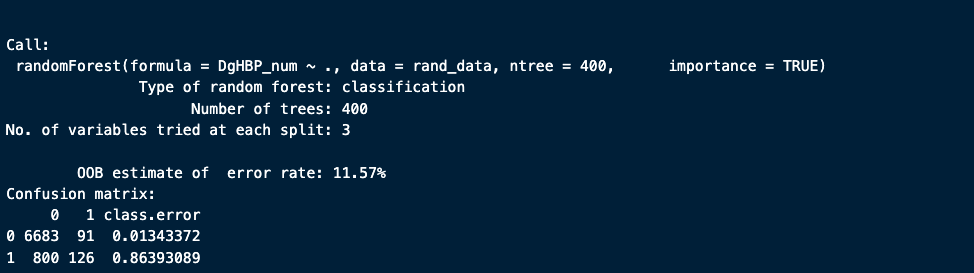

```{r setup, include=FALSE, warning=FALSE, echo=FALSE, error=FALSE}
#knitr::opts_chunk$set(dev=c('png', 'cairo_pdf'),  comment="", echo=T, warning=FALSE, cache=F, message=FALSE)
## Dependencies
library(knitr)
library(kableExtra)
library(gridExtra)
library(tidyverse)
library(xtable)
library(readxl)
library(writexl)
library(hrbrthemes)
library(cowplot)
library(viridis)
library(Cairo)
library(lubridate)
library(corrplot)
library(GGally)
library(ggforce)
library(patchwork)
library(caret)
library(randomForest)

## References
# https://www.cpc.unc.edu/projects/china
```
# Introduction    

According to the WHO, high blood pressure cases an estimated 7.5million deaths annually, which is about 12.8% of all deaths annually. The data used in this report is data gotten from the [China Health and Nutrition Survey](https://www.cpc.unc.edu/projects/china), an international collaborative project between the Carolina Population Center at the University of North Carolina at Chapel Hill and the National Institute for Nutrition and Health (NINH) at the Chinese Center for Disease Control and Prevention (CCDC). The studies are designed to examine the relationship between Nutrition (in this case Dietary Calcium), lifestyle/social factors, and health outcomes like Blood pressure, Hypertension occurrence, etc in rural and urban located populations. These studies are important to help guide officials making public health policies, or insurance organizations on risks for example. By analyzing the data, this report tries to seek patterns that could impact hypertensive health outcomes.  

```{r, echo=FALSE, cache=TRUE}
## Importing data used in analysis. 

bp_raw_data <- read_xlsx("~/Desktop/datasets/DATASET_DIETARY CALCIUM INTAKE AND HYPERTENSION IN URBAN AND RURAL POPULATIONS.xlsx")
bp_calcium_data <- bp_raw_data
```

## Understanding the raw data

Our dataset includes several important variables to enable our analysis. *Table 1* shows a brief summary of each column;    

```{r, echo=FALSE, cache=FALSE, tidy=TRUE}
description <- tibble(
  id = "Participants identification number each survey year. ID is maintained across years.",    
  Age = "Age at each survey year.",
  Location = "Participants living location at the time of survey. 1 denotes urban location and 2 for rural location.",
  Gender = "Participants gender. Number mapping not stated but can be 1 or 2",
  Nation = "Participant nationality.",  
  Waves = "Survey year. Data is for the years 2000, 2004, 2006 and 2009.",
  Smoking = "Denotes if the given participant smokes or not. 0 for non-smokers and 1 for smokers.",
  Alcohol = "Alcohol consumption frequency per week. 1 unit represents one glass of alcohol.",
  DgHBP = "Categories of either 0 or 1. 0 for no hypertention diagnosis, 1 for has hypertension diagnosis",
  SBP = "Average systolic blood pressure measurement taken from 3 measurements",  
  DBP = "Average diastolic blood pressure measurement taken from 3 measurements",  
  BMI = "The Body Mass Index calculated using an Adolphe Quetelet Formula",  
  NRG = "Energy intake of the participant expressed in kCal",
  DietCa = "Partiicpants dietary calcium intake measured in mg",
  Met_m = "Physical activity of participants expressed in the number of hours per week of physical activity"
  )

description_table <- pivot_longer(
  description,
  cols = everything(),
  names_to = "Variable",
  values_to = "Description"
)


kable(description_table, caption = "Columns with description",  booktabs = TRUE) %>%
  kable_styling(latex_options = c("striped", "condensed", "hold_position")) #bootstrap_options = c("striped", "condensed"),
```

After importing our dataset, it doesn't properly detect the datatype of each of the column as we can see in the table below. 

```{r, echo=FALSE, cache=FALSE, tidy=TRUE }
data_types <- sapply(bp_raw_data, class)
summary_types <- data.frame(
  "Data type" = data_types
)

kable(summary_types, caption = "Variables data types", booktabs = TRUE) %>%
  kable_styling(latex_options = c("striped"))
```

From the above we can see that our raw data is imported as numerical values for all columns even when we know some are categorical values and even a date type column (Waves) based on the information in **Table 1**. We can take a glimpse of how the data looks below;  

```{r, echo=FALSE, cache=TRUE, tidy=TRUE}
no_of_rows <- nrow(bp_raw_data)
no_of_cols <- ncol(bp_raw_data)

#gender_counts <- table(bp_calcium_data$Gender)
#gender_counts_prop <- prop.table(gender_counts)

#bp_females <- bp_calcium_data |> 
  #filter(Gender == 2)
#bp_males <- bp_calcium_data |>
#  filter(Gender == 1)


minAge <- min(bp_raw_data$Age)
maxAge <- max(bp_raw_data$Age)
avgAge <- mean(bp_raw_data$Age)

avgBmi <- mean(bp_raw_data$BMI, na.rm = TRUE)
bmi_na_count <- sum(is.na(
  bp_raw_data$BMI
))

prop_bmi_missing <- (bmi_na_count/no_of_rows) * 100

raw_random <- bp_raw_data |>
  filter(is.na(SBP) | is.na(DBP) | is.na(BMI)) |>
  head()

kable(raw_random, caption = "Sample from data", booktabs = TRUE) %>%
  kable_styling(latex_options = c("striped", "repeat_header", "HOLD_position"), font_size = 7)
```

From the above we can see several numerical variables as well as notice that there are missing values (NA) in our dataset. This is in addition to the wrong datatypes when the data was imported. The dataset contains `r no_of_rows` rows and `r no_of_cols` columns. The minimum age of a participant in the dataset is `r minAge` and the maximum age is `r maxAge`. 

In order to know the type of cleaning of the raw dataset that we need to do, first we need to understand the raw data a bit more like its distribution, missing data or other data anomalies like outliers.

From the data description above, we would see that some columns are categorical and others are not. The table below gives a summary of the numerical columns; 

```{r, echo=FALSE, cache=TRUE, tidy=TRUE}

kable(summary(bp_raw_data %>%
  select(c(Age, BMI, SBP, DBP, NRG, DietCa, Met_m))), booktabs = TRUE, caption = "Non categorical columns summary") %>%
  kable_styling(latex_options = c( "striped"), font_size = 7)
```

From the above we can see the columns that have missing data (NA) as well as the number of missing data, we can also see the 1st and 3rd quartiles, min and maximum and the mean and median values as well, this helps us get an idea of the distribution and proportions. For example looking at the difference in the mean and median of SBP, DietCa, Met_m, and NRG, we can tell that their distributions are skewed unlike Age and BMI, this may be due to anomalies. Looking at the quartile for NRG for example and comparing it with the max value we can get the idea that there's a major outlier here if we see such a difference between the max value and the 75th percentile. We can also see that for these variables, BMI, SBP, DBP, and Met_m have missing values. To get a sense of the distributions, we can check a quantile-quantile plot of these variables to see how much it approximates with a normal distribution.  

```{r, echo=FALSE, warning=FALSE, cache=TRUE, fig.width=7, fig.height=7}
ageQQ <- ggplot(bp_raw_data, aes(sample = Age)) +
  stat_qq() +
  stat_qq_line() +
  theme(
    legend.text = element_text(size = 5),
    legend.title = element_text(size = 4, face = "bold")
  ) +
  ylab("Age") 
  

bmiQQ <- ggplot(bp_raw_data, aes(sample = BMI)) +
  stat_qq() +
  stat_qq_line() +
  theme(
    legend.text = element_text(size = 5),
    legend.title = element_text(size = 4, face = "bold")
  ) +
  ylab("BMI") 

phys <- ggplot(bp_raw_data, aes(sample = Met_m)) +
  stat_qq() +
  stat_qq_line() +
  theme(
    legend.text = element_text(size = 5),
    legend.title = element_text(size = 4, face = "bold")
  ) +
  ylab("Physical Activity (Met_m)") 

dietCa <- ggplot(bp_raw_data, aes(sample = DietCa)) +
  stat_qq() +
  stat_qq_line()  +
  theme(
    legend.text = element_text(size = 5),
    legend.title = element_text(size = 4, face = "bold")
  ) +
  ylab("Dietary Calcium (DietCa)") 

sbp <- ggplot(bp_raw_data, aes(sample = SBP)) +
  stat_qq() +
  stat_qq_line() +
  theme(
    legend.text = element_text(size = 5),
    legend.title = element_text(size = 4, face = "bold")
  ) +
  ylab("SBP") 

dbp <- ggplot(bp_raw_data, aes(sample = DBP)) +
  stat_qq() +
  stat_qq_line() +
  theme(
    legend.text = element_text(size = 5),
    legend.title = element_text(size = 4, face = "bold")
  ) +
  ylab("DBP") 

nrg <- ggplot(bp_raw_data, aes(sample = NRG)) +
  stat_qq() +
  stat_qq_line() +
  theme(
    legend.text = element_text(size = 5),
    legend.title = element_text(size = 4, face = "bold")
  ) +
  ylab("Energy Intake (NRG)") 

plot_grid(
  ageQQ, bmiQQ, phys, dietCa, sbp, nrg, ncol = 2
)


```

From the above we can see that Age is the most normally distributed variable as most of the points fall within the line. DBP and BMI also seem fairly normally distributed. Met_m and SBP are not normally distributed, while NRG and DietCa are very skewed as many values fall off the line greatly (outliers).   

### BMI  
We can see that the average BMI of participants is around `r round(avgBmi, 2)`, which suggests a healthy population. However there over `r bmi_na_count` missing values, which makes up about `r round(prop_bmi_missing, 1)`% of data. We can also observe that the minimum BMI in the data set is around 13, which is an unhealthy BMI and falls within a severely underweight BMI, the maximum BMI is also a very unhealthy number.  

```{r echo=FALSE, cache=FALSE, warning=FALSE, tidy=TRUE, out.height="35%"}
## na values automatically removed
bmi_with_na_plot <- bp_raw_data |>
  filter(!is.na(BMI)) |>
  ggplot(aes(x = BMI, y = ..density..)) +
  geom_histogram(binwidth = .5, fill = "#69b3a2", color = "#e9ecef", alpha = 0.6) + #aes(y = ..density..), 
  geom_density(color = "#69b3a2", alpha = 0.8) +
  labs(
    title = "Histogram of BMI Distribution",
    caption = "Fig1"
    ) +
  #geom_vline(aes(xintercept = avgBmi), color = "black", linetype = "dashed", size = 1) +
  theme_minimal() +
  theme(
    plot.title = element_text(size = 11)
  ) +
  xlab("BMI") +
  ylab("Density")

bmi_boxplot <- bp_raw_data |> 
  filter(!is.na(BMI)) |>
  ggplot(aes(x = factor(Location), y = BMI, fill = factor(Location))) +
  geom_boxplot() +
  theme_minimal() +
  geom_jitter( size = 0.2, alpha = 0.4) +
  scale_fill_viridis(discrete = TRUE) +
  theme(
    legend.position = "none",
    plot.title = element_text(size = 11)
  ) +
  xlab("Location") +
  labs(
    title = "BMI by Location",
    subtitle = "Boxplot with jittering to show density",
    caption = "Fig2"
    ) 

bmi_with_na_plot

location_prop <- prop.table(table(factor(bp_raw_data$Location)))
```

In **Fig1** above, we can see that the BMI is evenly distributed but there are outliers which we can clearly see from the long tail which slightly skews the chart. We can also look at the BMI based on the location given that most of our is comparing variables based on the location.     

```{r, echo=FALSE, tidy=TRUE, out.height="35%"}
systolic_na_prop <- round((mean(is.na(bp_raw_data$SBP)) * 100), 1)
diastolic_na_prop <- round((mean(is.na(bp_raw_data$DBP)) * 100), 1)
bmi_boxplot
```

From **Fig2** we can see that the distribution for both locations is evenly distributed with outliers. From the density of points in the jittered boxplot, we can also see that there are more data collected for Location 2, which turns out to be about `r round(location_prop[2], 2) * 100`% of participants. We also see that the average BMI of Location 1 participants is slightly higher than that of rural participants.   

### SBP (Systolic Blood Pressure) and DBP (Diastolic Blood Pressure)    
In **Table 4**, we observe that the values for DFB range from 25.33*mmHg* to 170*mmHg*, the mean and median are also around the same value which indicates that the distribution is approximately symmetrical (not skewed) and data is evenly distributed around the center (bell curve). We also observe that there are 854 missing values, which makes up about `r diastolic_na_prop`% of the data, a significant proportion. For the SBP measurements we can see that the the values ranges from 76.67*mmHg* to 240*mmHg*, the difference in the mean and median values also suggests that the distribution is more skewed than the diastolic measures. Also, about 7% of the values are missing. Given this understanding, we now have an idea of how to handle the missing data or outliers which we would cover in a later section. **Fig3** shows a density chart of these measures, we can notice the long tail of SBP, which suggests that there could be outliers here.  

```{r, echo=FALSE, cache=FALSE, warning=FALSE, tidy=TRUE, out.height="35%"}
systolic_diastolic_reshaped <- bp_raw_data |>
  select(SBP, DBP, Location) |>
  pivot_longer(cols = c(SBP, DBP), names_to = "BP Measure", values_to = "Value") |>
  filter(!is.na(Value))
  
bp_density_plot <- systolic_diastolic_reshaped |>
  ggplot(aes(x = Value, fill = `BP Measure`, color = `BP Measure`)) + 
  geom_density(alpha = 0.6) +
  theme_grey() +
  xlab("Systolic and Diastolic blood pressure") +
  ylab("") +
  theme(
    legend.position = c(.95, .95),
    legend.justification = c("right", "top"),
  ) +
  scale_fill_discrete(
    name = "Blood Pressure Measure",
    labels = c("Diastolic", "Systolic")
    ) +
  scale_color_discrete(
    name = "Blood Pressure Measure",
    labels = c("Diastolic", "Systolic")
  ) +
  labs(caption = "Fig3") 

bp_density_plot
```

The violin plot below (**Fig4**) shows the quantiles of values for SBP and DBP. We can see that most of the DBP values are between 70 and 90, and most of the SBP values are between 110 and 130. We can also clearly see the long tail that shows the outlier and skew in SBP, therefore we need to tackle the outliers here as well before analysis.

```{r, echo=FALSE, cache=TRUE, warning=FALSE, out.height="35%"}
systolic_diastolic_violin <- systolic_diastolic_reshaped |>
  ggplot(aes(x = `BP Measure`, y = Value, fill = `BP Measure`)) +
  geom_violin(alpha = 0.7) +
  #facet_wrap( ~ factor(Location)) +
  theme_grey() +
  scale_y_continuous(breaks = seq(0, 250, 20)) +
  xlab("Diastolic / Systolic Blood Pressure") +
  ylab("Value") +
  labs(caption = "Fig4") +
  theme(legend.position="none") 

systolic_diastolic_violin
```

### Dietary Calcium (DietCa)    
Dietary calcium is core to our analysis and looking at the data, we can see that participants take a very varying amount of dietary calcium. From **Table 3** above, we can see that the mimimum dietary calcium intake is 0*mg* and the maximum is 19,671*mg*, these are both way outside the recommended proportions of calcium per day which we would explore in detail for these values as they could be anomalies to handle when cleaning the data. We can also see the difference between the mean and median values which shows that the distribution is skewed as the following chart shows.  

```{r, echo=FALSE, cache=FALSE, out.height="35%"}
calc_intake_density <- bp_raw_data |>
  select(Location, DietCa) |>
  ggplot(aes(x = DietCa)) +
  geom_histogram(binwidth = 30, fill = "#69b3a2") +
  geom_density(color = "#69b3a2", fill = "#69b3a2") +
  scale_x_continuous(breaks = seq(0, 20000, 2000)) +
  theme_grey() +
  labs(
    caption = "Fig5"
  ) +
  xlab("Calcium intake/day (mg)") +
  ylab("") 

calc_intake_density
```

In **Fig5** above we can see that the data is massively skewed, we also observe that majority of participants take below 700*mg* per day, therefore something might be wrong with the data to cause such a massive skew, or test the hypothesis that there would be high prevalence or elevated risk of high blood pressure among participants with high values. If we look at the boxplot by location, we can see there are outliers in the dataset, and the jittering shows that a bulk of the data are below 700*mg*.

```{r, echo=FALSE, cache=TRUE, out.height="35%"}
diet_calc_box <- bp_raw_data |> 
  select(Location, DietCa) |>
  ggplot(aes(x = factor(Location), y = DietCa, fill = factor(Location))) +
  geom_boxplot() +
  scale_fill_viridis(discrete = TRUE, alpha = 0.9) +
  geom_jitter(color = "grey", size = 0.2, alpha = 0.2) +
  scale_y_continuous(breaks = seq(0, 20000, 1500)) +
  theme_gray() +
  theme(
    legend.position = "none",
    plot.title = element_text(size = 12)
  ) +
  xlab("Location") +
  ylab("Calcium intake/day (mg)") +
  labs(
    title = "Dietary Calcium by Location",
    caption = "Fig6"
    ) 

diet_calc_box
```

From **Fig7** above, we can see that the outliers drastically skewed data, especially the data from participants in Location 2, so in order to work with this measure, we also need to address this.  

### Smoking, Gender, Alcohol, DgHBP    
```{r, echo=FALSE, cache=TRUE, warning=FALSE}
gender_1_prop <- round((mean(bp_raw_data$Gender == 1) * 100), 2)
gender_2_prop <- round((mean(bp_raw_data$Gender == 2) * 100), 2)
```
We can quickly also look at the distribution of the categorical variables (proportions). In the dataset, both genders are represented although which gender it is isn't specified. We can observe that Gender 1 makes up `r gender_1_prop`% of the data and gender 2 makes up the remaining `r gender_2_prop`%. From the plot below, We can also see that most of the participants are non smokers (plot **b**). In plot **c** we can see that most of the participants are not reported to be hypertensive after diagnosis, so hypertension isn't prevalent amongst participants. In plot **d** we can see that most of the participants drink at least 0 glass of alcohol per week although there are participants who average 3+ glasses per week as seen in the boxplot. Also, there are missing data for Alcohol(59), Smoking(2).

```{r, echo=FALSE, cache=TRUE, warning=FALSE, out.width="80%"}

# Gender

gender_factors <- factor(bp_raw_data$Gender)
bp_raw_data$Gender <- gender_factors

gender_barchart <- bp_raw_data |>
  select(Gender) |>
  ggplot(aes(x = Gender, fill = Gender)) +
  geom_bar(width = 0.4) +
  #scale_fill_viridis(discrete = TRUE) +
  theme_minimal() +
  xlab("Gender") +
  theme(
    legend.position = "none",
     plot.title = element_text(size = 8)
  )
  
  # scale_fill_discrete(
  #   name = "Gender",
  #   labels = c("Male", "Female")
  #   ) +
  # scale_color_discrete(
  #   name = "Gender",
  #   labels = c("Male", "Female")
  # ) 

## Smoking
smoke_factors <- factor(bp_raw_data$Smoking)
bp_raw_data$Smoking <- smoke_factors
#table(bp_calcium_data$Smoking, useNA = "always")
smoker_formatted <- bp_raw_data |>
  filter(!is.na(Smoking)) |>
  mutate(Smoke = fct_recode(Smoking,
                           "Non-smoker" = "0",
                           "Smoker" = "1"
                           )
         )


smoker_barchart <-  smoker_formatted |>
  select(Smoke) |>
  ggplot(aes(x = Smoke, fill = Smoke)) +
  geom_bar( width = 0.4) +
  scale_fill_viridis(discrete = TRUE, option = "A") +
  theme_minimal() +
  xlab("Smoke") +
  theme(
    legend.position = "none",
     plot.title = element_text(size = 8)
  ) 

## Diagnostic Report
diagnostic_factors <- factor(bp_raw_data$DgHBP)
bp_raw_data$DgHBP <- diagnostic_factors
#table(bp_calcium_data$DgHBP, useNA = "always") # no missing values

diagnosed_formatted <- bp_raw_data |>
  mutate(Diagnosed = fct_recode(DgHBP,
                           "No report" = "0",
                           "Has report" = "1"
                           )
         )


diagnosis_barchart <-  diagnosed_formatted |>
  select(Diagnosed) |>
  ggplot(aes(x = Diagnosed, fill = Diagnosed)) +
  geom_bar(width = 0.4) +
  scale_fill_viridis(discrete = TRUE) +
  theme_minimal() +
  xlab("Hypertention Diagnosis") +
  theme(
    legend.position = "none",
     plot.title = element_text(size = 8)
  )

## Alcohol Consumption Frequency
alcohol_consumption_plot <- bp_raw_data |>
  filter(!is.na(Alcohol)) |>
  ggplot(aes(y = Alcohol)) +
  geom_boxplot(fill = "#69b3a2") +
  scale_y_continuous(breaks = seq(0, 8, 2)) +
  theme_minimal() +
  ylab("Glass per week") +
  xlab("Alcohol consumption per week") +
  theme(
    plot.title = element_text(size = 8)
  )

## Location 
location_plot <- bp_raw_data |>
  mutate(Location = as.factor(Location)) |>
  ggplot(aes(x = Location, fill = Location, color = Location)) +
  geom_bar() +
  theme_minimal() +
  xlab("Location") +
  theme(
    plot.title = element_text(size = 8),
    legend.position = "none"
  ) 
  

plot_grid(
  gender_barchart, smoker_barchart, diagnosis_barchart, location_plot, ncol = 2, labels = "auto"
  )
```

# Data Cleaning and preparation
Data cleaning involves actions taken to get our data in a state that it is ready for analysis and also without issues that could bias the result of our analysis. This usually involves handling missing data, handling anomalies in our data like unexpected values and categories, outliers, fixing formatting errors, data type formats, etc. In the above section, we went through some of the variables in our raw dataset to understand the data as well as other necessary details that needs to be done to clean our data like missing values, outliers, and data types, and other summary statistics. In this section we would use this information to guide our decisions on how to clean our data and make it ready for analysis. 

## Cleaning data   

In **Table 2** we saw that several categorical types are imported as numerical (continuous) variables, these includes the variables *Location*, *Nation*, *Smoking*, which we would need to convert to categorical values (factor) and maybe give more descriptive names like renaming 1 in the Location variable to Urban and 2 to Rural. We can also see that *Waves*, which represents the survey years is imported as numeric so we would change it to a date column, but for the purpose of our analysis that may not be necessary. We can also rename some columns to make it clear what they do, like renaming **id** to **ParticipantId**, because at its current naming it seems like value is unique but it isn't really unique as it mostly represents the id of a participant so the same id occurs multiple times for each survey year, we also change the name to be uppercamelcase to maintain consistency with other variable names. After doing these, our columns now looks like the table below, compared to **Table 2** we saw earlier.  

```{r, echo=FALSE, cache=TRUE}
bp_calcium_data <- bp_raw_data |>
  rename(ParticipantId = id, Year = Waves) |>
  mutate(
    Location = fct_recode(
      as.factor(Location),
      "Urban" = "1",
      "Rural" = "2"
      ),
    Year = ymd(paste0(Year, "-01-01")),
    Gender = as.factor(Gender),

    Nation = as.factor(Nation),
    Smoking = fct_recode(
      as.factor(Smoking),
      "Non Smoker" = "0",
      "Smoker" = "1"
      ),
    DgHBP = fct_recode(
      as.factor(DgHBP),
      "Not Hypertensive" = "0",
      "Hypertensive" = "1"
      )
  )

data_types <- sapply(bp_calcium_data, class)
summary_types <- data.frame(
  "Data type" = data_types
)

kable(summary_types, caption = "Variables data types", booktabs = TRUE) %>%
  kable_styling(latex_options = c( "striped"), font_size = 7)
```

## Handling Missing Data and Outliers      

From our initial analysis, we saw that the following variables had missing values; *Smoking*, *Alcohol*, *SBP*, *DBP*, *BMI*, as well as *Met_m*. While there are many ways of dealing with missing data, knowing how to deal with them also depends on context of how they were collected or even domain knowledge around the variables. Some strategies for dealing with missing data could include deletion, imputation or even model based methods. In our situation, we would be making use of both deletion and imputation methods.

In our dataset, we can see that only two items are missing in the Smoking column, both participants (ParticipantId 1861 and ParticipantId 1933) have a diagnosis report of not being hypertensive and have values that fall within the normal distribution for the systolic and diastolic blood pressure measurement, so it seems like these samples are already well represented and it wouldn't affect our result to remove these rows from our dataset.

For Alcohol, there are 59 missing values, a small amount, however we would be inputing the data. Our method for inputing would be based on the participant id and their average number of glasses in rows where they have data for Alcohol. So for example, for participantId 1145 which has 2 missing glasses of alcohol values, we would get the average (mean) number of glasses of alcohol this participant takes and the use that to input the glasses of alcohol for the missing value, and we would do this for each of the distinct ParticipantId.

From our initial analysis, we saw that the Diastolic measure (DBP) is evenly distributed and fairly symmetrical with both mean and median approximately 80**mmHg**, so given the distribution, the mean is robust enough as it properly generalizes the data we have. We would also apply the missing data based on the location by getting the average measure for the location of the participant. For the Systolic measures (SBP) we would do something similar but instead of using the mean, we would use the median, the reason for this is because based on our earlier analysis, we noticed that there are variables which skewed the distribution and median is more robust than mean for such distributions, so it better captures the distribution. In the case of SBP, we also didn't just group by Location, we also grouped by gender to get the median values used for impute.

For BMI missing data, we would use the mean to fill the missing data because we can see from the analysis earlier that the distribution is distributed and slightly vary by location. And for the Met_m variable, we would simply remove rows with missing data as there are just 8 of them.

While there are many more ways to handle missing data which could get complex based on result of contextual analysis, our methods have been effective as it ensured our distribution didn't change shape.

From our exploration of DietCa and NRG, we noticed that the data was massively skewed due to some outliers that seems like impossible numbers. According to the US National Institute of Health, the recommended daily intake varies by age as shown in the following table;  
```{r, echo=FALSE, warning=FALSE, cache=TRUE}
calcium_recommended <- tibble(
  "0-6 months" = "200 mg", 
  "7-12 months" = "260 mg",
  "1-3 years" = "700 mg",
  "4-8 years" = "1,000 mg",
  "9-13 years" = "1,300 mg",
  "14-18 years" = "1300 mg",
  "19-50 years" = "1,000 mg",
  "Men 51-70 years" = "1,000 mg",
  "Women 51-70 years" = "1,200 mg"
  )

description_table <- pivot_longer(
  calcium_recommended,
  cols = everything(),
  names_to = "Age",
  values_to = "Recomendation"
)

#quantile(cleaned_bp_data$DietCa, probs = seq(0.1, 1, by = 0.01))

kable(description_table, caption = "Recommended Calcium daily intake", booktabs = TRUE) %>%
  kable_styling(latex_options = c("striped", "repeat_header", "HOLD_position"), font_size = 7)
```

From the above table, if we compare with *Fig6* we would see that several of the participants take above 1,300*mg/day*. For the data point causing the most skew, if we filter our data we would see that this participant (participantId 2898) had that value in the year 2000, meanwhile his values in other years are all below 500 even when other variables are constant, so there's a high chance this was an input error and so we would be removing this outlier. Another reason for removing this outlier is that it offers nothing of importance to our analysis as there's too few of them around those values. Concerning the other values in this column that are shown as outliers in *Fig6*, if we check the quantiles we would see that 99% of participants take below 1500*mg* and only about 1% take above this. For the purpose of our analysis comparing Blood pressure, we would leave these values as features as it doesn't like they were input errors. 

We can go further to perform other actions like reshaping the data, create new variables, etc. But these are mostly dependent on context and intent of analysis or question being asked. After doing the cleanup above, our dataset is now looking cleaner with no missing values, values properly imputed or removed as well as outliers addressed. Looking at the same slice of data as **Table 3** above, our data is now much cleaner. And if we look at the dimensions, we now have 12,030 rows instead of 12,052 rows we started with. 

```{r, echo=FALSE, cache=TRUE, tidy=TRUE, warning=FALSE }
# Alcohol
missing_alcohol <- bp_calcium_data |>
  filter(is.na(Alcohol)) |>
  select(ParticipantId)

missing_alcohol_vector = missing_alcohol$ParticipantId

alcohol_missing <- bp_calcium_data  |>
  select(ParticipantId, Alcohol) |>
  filter(!is.na(Alcohol)) |>
  group_by(ParticipantId) |>
  summarise(
    Alcohol = mean(Alcohol)
  ) |>
  filter(ParticipantId %in% missing_alcohol_vector)

# DBP
dbp_avg <- bp_calcium_data |>
  select(DBP, Location) |>
  group_by(Location) |>
  summarise(DBP = mean(DBP, na.rm = TRUE), .groups = "keep")

# SBP 
sbp_imput <- bp_calcium_data |>
  select(SBP, Location, Gender) |>
  group_by(Location, Gender) |>
  summarise(SBP = mean(SBP, na.rm = TRUE), .groups = "keep")

# BMI
bmi_avg <- bp_calcium_data |>
  select(BMI, Location) |>
  group_by(Location) |>
  summarise(BMI = mean(BMI, na.rm = TRUE), .groups = "keep")


cleaned_bp_data <- bp_calcium_data |>
  filter(!is.na(Smoking)) |> # Smoking
  left_join(alcohol_missing, by = "ParticipantId", suffix = c("", "_from_missing")) |> # imputed data for Alcohol
  mutate(
    Alcohol = coalesce(Alcohol, Alcohol_from_missing)
  ) |>
  select(-Alcohol_from_missing) |> 
  left_join(dbp_avg, by = "Location", suffix = c("", "_from_missing")) |> # imputed data for DBP
  mutate(
    DBP = coalesce(DBP, DBP_from_missing)
  ) |>
  select(-DBP_from_missing) |>
  left_join(sbp_imput, by = c("Location", "Gender"), suffix = c("", "_from_missing")) |> # imputed data for SBP
  mutate(
    SBP = coalesce(SBP, SBP_from_missing)
  ) |>
  select(-SBP_from_missing) |>
  left_join(bmi_avg, by = "Location", suffix = c("", "_from_missing")) |> # imputed data for BMI
  mutate(
    BMI = coalesce(BMI, BMI_from_missing)
  ) |>
  select(-BMI_from_missing) |>
  filter(!is.na(Met_m)) |>
  filter(DietCa < 15000) |>
  filter(NRG <= 10000)

sample_head <- cleaned_bp_data |>
  filter(
    (ParticipantId == 6 & year(Year) %in% c(2009, 2006)) |
      (ParticipantId == 19 & year(Year) %in% c(2009, 2006, 2000)) |
      (ParticipantId == 35 & year(Year) %in% c(2009))) 

kable(sample_head |> 
        select(ParticipantId, Age, Location, Gender, Nation, Year, Smoking, Alcohol, DgHBP), caption = "Sample from clean data", booktabs = TRUE) %>%
  kable_styling(latex_options = c("striped", "repeat_header", "HOLD_position"), font_size = 7)

kable(sample_head |> 
        select(-c(ParticipantId, Age, Location, Gender, Nation, Year, Smoking, Alcohol, DgHBP)), caption = "Sample from clean data", booktabs = FALSE) %>%
  kable_styling(latex_options = c("striped", "repeat_header", "HOLD_position"), font_size = 7)

```

Now our data is ready to be used for analysis, which we look into in the following section.  


# Data Analysis and Visualization    
Visualization techniques are useful tools that helps us provide a clearer picture of the underlying data. In this section we would be looking at our data from different angles and relationships and try to visualize this relationships to make sense of our data while answering more interesting questions. At the core of our exploration, we would try to focus on how dietary calcium intake relates to blood pressure and the occurrence of hypertension, as well as any other factor which might influence this relationship.  We'll start with a correlation analysis to example the relationship between the variables. 

## Overview    

**Fig7** below shows a Pairwise Correlogram (correlation matrix) of the variables in our dataset so we can see how they all correlate with each other. Here we can immediately observe that there's no direct correlation (values of 0) between most of the variables, however we can also observe the following; 


```{r, echo=FALSE, cache=TRUE, out.width="100%", tidy=TRUE, fig.width=10, fig.height=8} 

bp_level <- function(systolic, diastolic) {
  case_when(
    systolic < 120.0 & diastolic < 80.0 ~ "Normal",
    (systolic >= 120.0 & systolic < 130) & diastolic < 80.0 ~ "Elevated",
    (systolic >= 130.0 & systolic < 140.0) | (diastolic >= 80.0 & diastolic < 90.0) ~ "HBP Stage 1", ## considered normal
    (systolic >= 140.0 & systolic < 180.0) | (diastolic >= 90.0 & diastolic < 120.0) ~ "HBP Stage 2",
    systolic >= 180.0 | diastolic >= 120.0 ~ "HBP Stage 3",
    TRUE ~ "Uncategorized"
  )
}

cleaned_bp_data <- cleaned_bp_data |>
  mutate(Bp.State = bp_level(SBP, DBP)) |>
  mutate(Bp.State = factor(Bp.State, levels = c("Normal", "Elevated", "HBP Stage 1", "HBP Stage 2", "HBP Stage 3")))


corr_plot <- cleaned_bp_data |>
  mutate(
    Smoking = as.numeric(Smoking),
    Bp.State = as.numeric(Bp.State),
    Location = as.numeric(Location),
    Gender = as.numeric(Gender),
    DgHBP = as.numeric(DgHBP)
    ) |> # select(Age, SBP, DBP, BMI, NRG, DietCa, Met_m, Alcohol, ParticipantId, as.numeric(Smoking))
  select(-c(Year, Bp.State, ParticipantId, Nation)) |>
  ggcorr(method = c("everything", "spearman"), label = TRUE) +
  theme(
    text = element_text(
      size = 1,
      face = "plain",
      color = "black"
      ),
    axis.text = element_text(size = 3),          
    legend.title = element_text(face = "bold")  
  ) +
  labs(
    #title = "Pairwise Correlation Matrix",
    caption = "Fig7"
  ) +
  theme_classic()

corr_plot
```

- We can see that there is a strong positive correlation between Blood Pressure (SBP and DBP) and Hypertension occurrence diagnosis (DgHBP). This suggests that for participants in our data, higher blood pressure readings leads to more chances of being diagnosed as hypertensive. 
- We can also observe that there is a strong positive correlation between higher blood pressure readings, positive hypertension diagnosis, and higher BMI values. This indicates that the higher the blood pressure readings, the higher the chances of positive hypertension diagnosis, and the more likely the participant would have a higher BMI value. This is also another established fact as numerous studies have demonstrated that the risk of hypertension rises significantly as BMI increases, and also that obesity (BMI > 30) is a risk factor for Hypertension.  
- From the correlogram we can also see that there's a strong positive correlation between Age and blood pressure (SBP and DBP) readings with Hypertension diagnosis occurence (DgHBP), which suggests that as the Age increases, the blood pressure readings is also likely to increase, same as the likelihood or a hypertension diagnosis amongst participants.    
- We can also see that there is no strong correlation between Dietary Calcium intake (DietCa) and Blood Pressure (DBP, SBP), or between DietCa and Hypertension Diagnosis (DgHBP). Considering this, we might need to do further analysis to check if there is any indirect relationship between these readings and Dietary Calcium intake.  
- Among participants, we also notice that there is a negative correlation between Physical activity (Met_m) and Alcohol or Smoking, which suggests that participants who engaged in physical activity more usually don't smoke or drink each week. 
- Also about physical activity (Met_m), we also observe from the data that there is a strong inverse correlation (negative) between physical activity and the blood pressure readings, which suggests that the more physical activity participants engage in, the lower their blood pressure. 
- The relationship also between Gender and Physical activity (Met_m) is also a very strong one. Since we know Gender is a categorical variable (1, and 2), this suggests that the higher gender is much more physically active than the lower gender.   
- Based on the correlogram, we can also see that the Location has an inverse relationship with hypertension diagnosis occurence, however there is a weak correlation with the blood pressure reasons. This suggests that the correlation with DgHBP could be due to confounding factors or as a result of the sample size because of participants as the Location value (2) has significantly more participants.  

While there are several other observations we can deduce, we can explore the data in more dimensions and other indirect relationship that may not be deducible above. 

## More Observations 

We can look at the prevalence of hypertension in the study to examine the proportion of individuals diagnosed with hypertension and how it varies with age, location and gender.  
```{r, echo=FALSE, cache=TRUE}
fig8 <- cleaned_bp_data |>
  ggplot(aes(x = DgHBP)) +
  geom_bar(position = "stack") +
  geom_text(stat = "prop", position = position_stack(.5), color = "white", fontface = "bold") +
  labs(
    caption = "Fig8"
  ) +
  theme_minimal() +
  xlab("") +
  coord_flip()

fig9 <- cleaned_bp_data |>
  ggplot(aes(x = DgHBP, fill = Location, color = Location)) +
  geom_bar(position = "stack") +
  geom_text(stat = "prop", position = position_stack(.5), color = "white", fontface = "bold", size = 2.5) +
  labs(
    caption = "Fig9"
  ) +
  theme_minimal()  +
  theme(
    legend.text = element_text(size = 7),
    legend.title = element_text(size = 8, face = "bold")
  ) +
  ylab("") +
  xlab("") +
  coord_flip()

fig10 <- cleaned_bp_data |>
  ggally_colbar(aes(x = DgHBP, y = Location, fill = Location, color = Location), color = "white", fontface = "bold", size = 2.7) +
  labs(
    caption = "Fig10"
  ) +
  theme(
    legend.text = element_text(size = 7),
    legend.title = element_text(size = 8, face = "bold")
  ) +
  ylab("") +
  xlab("") +
  theme_minimal() +
  coord_flip()

plot_grid(fig8, fig9, fig10, ncol = 1)
```

From **Fig8** above, we can see that ~87.9% of participants are Not Hypertensive, and the remaining 12.1% are hypertensive. If we look how this compares in total with the location of participants, **Fig9** shows that 64% of participants are non-hypertensive and live in rural areas, and 23.9% are also non-hypertensive but live in urban areas. Of the 12.1% hypertensive participants, 7% are from rural areas while the remaining 5% are from urban areas. **Fig10** shows that of all hypertensive patients, 72.8% are from rural areas, while 27% are from urban areas. We can also see the proportion of the location of hypertensive participants that a majority of them are also from rural areas. If we consider that most participants are from rural areas, it does make sense that these variables are mostly dominated by people from this location, which might skew results during comparison involving location. So for the study, we can conclude that hypertension was more prevalent in participants from rural areas, however this may be because most of participants are from rural areas (87.9%) and not just because of the location. More tests may need to be carried out to be sure if the prevalence we observe is significantly because of location.    

```{r, echo=FALSE, cache=TRUE, out.height="50%", fig.height=5}
fig11 <- cleaned_bp_data |>
  ggplot(aes(x = DgHBP, fill = Gender, color = Gender)) +
  geom_bar(position = "stack") +
  geom_text(stat = "prop", position = position_stack(.5), color = "white", fontface = "bold") +
  theme_minimal() +
  theme(
    legend.position = c(.97, .97),
    legend.justification = c("right", "top"),
    legend.text = element_text(size = 7),
    legend.title = element_text(size = 7, face = "bold"),
    legend.key.size = unit(0.4, "cm")
  ) +
  labs(caption = "Fig11") +
  ylab("") +
  xlab("") 

fig12 <- cleaned_bp_data |>
  ggally_colbar(aes(x = DgHBP, y = Gender, fill = Gender, color = Gender), color = "white", fontface = "bold") +
  labs(
    caption = "Fig12"
  ) +
  ylab("") +
  xlab("") +
  theme_minimal() +
  theme(
    legend.position = "none"
  ) 

plot_grid(fig11, fig12, ncol = 2)
```

If we look at the prevalence of hypertension with gender, in **Fig11** we observe that about 55.4% are of Gender 1, and of this, 50% of them are not hypertensive. Of the remaining ~45% that are of Gender 2, majority of them are also non hypertensive. **Fig12** shows that hypertension was more prevalent in Gender 2 participants. 

```{r, echo=FALSE, fig.height=4, fig.width=8}

cleaned_bp_data <- cleaned_bp_data |>
  mutate(
    AgeGroup = factor(
      case_when(
      Age >= 13.0 & Age <= 18.0 ~ "Adolescent",
      Age > 18.0 & Age <= 29.0 ~ "Young Adult",
      Age > 29.0 & Age <= 64.0 ~ "Adult",
      Age > 64.0 ~ "Senior",
      TRUE ~ "Uncategorized"
      ), levels = c("Adolescent","Young Adult", "Adult", "Senior")
    )
  ) 

fig13 <- cleaned_bp_data |>
  ggplot(aes(x = Age, y = DgHBP, colour = AgeGroup)) +
  geom_jitter(size = 0.6) +
  theme_minimal() +
  ylab("") +
  xlab("") +
  labs(
    caption = "Fig13"
  )

fig13
```

In **Fig13**, we see the prevalence of hypertension across different age groups in the study. We can easily see that Hypertensive participants are largely individuals over 29yrs old and above. 

If we look the relationship between lifestyle and blood pressure and hypertension. 
```{r, echo=FALSE, warning=FALSE,cache=TRUE, out.width="80%"}

unset <- cleaned_bp_data |>
  ggplot(aes(x = BMI, y = Met_m, colour = Smoking)) +
  geom_point(size = 1) +
  facet_wrap(~AgeGroup)

dgHbp_summary <- cleaned_bp_data |>
  group_by(DgHBP) |>
  summarise(
    Avg.BMI = mean(BMI),
    Avg.DietCa = median(DietCa),
    Avg.Met_m = median(Met_m),
    Avg.NRG = median(NRG)
  )

bpReading_summary <- cleaned_bp_data |>
  group_by(Bp.State) |>
  summarise(
    Avg.BMI = mean(BMI),
    Avg.DietCa = median(DietCa),
    Avg.Met_m = median(Met_m),
    Avg.NRG = median(NRG)
  )

fig15 <- dgHbp_summary |>
  ggplot(aes(x = DgHBP, y = Avg.Met_m)) +
  geom_segment(aes(xend = DgHBP, yend = 0)) +
  geom_point(size = 4, color = "orange") +
  theme_minimal() +
  xlab("") +
  coord_flip() +
  labs(caption = "Fig15")


fig16 <- bpReading_summary |>
  mutate(Bp.State = fct_reorder(Bp.State, Avg.Met_m)) |>
  ggplot(aes(x = Bp.State, y = Avg.Met_m)) +
  geom_segment(aes(xend = Bp.State, yend = 0)) +
  geom_point(size = 4, color = "orange") +
  theme_minimal() +
  xlab("") +
  ylab("Physical Activity") +
  labs(caption = "Fig16")


fig18 <- cleaned_bp_data |>
  ggplot(aes(x = Bp.State, fill = Bp.State)) +
  geom_bar() +
  theme_minimal() +
  labs(caption = "Fig18") +
  ylab("")

fig15

```

**Fig15** shows the average physical activity of both hypertensive groups, it suggests that there is no difference in the physical activity of both groups, if we take a look from the dimension of the blood pressure, we see a different picture. 

```{r, echo=FALSE, warning=FALSE, fig.height=4}
fig18
```

**Fig18** shows the proportion of participants based on their blood pressure reading after grouping, we can see that participants on HBP.Stage3 are very small so result from this group may not properly represent the its population. 

```{r, echo=FALSE, warning=FALSE, fig.height=4}
fig16
```

Combining these factors, **Fig16** shows that participants who had the most physical activity have a normal blood pressure, showing a good relationship with hyperthention occurrence with physical activity which **Fig15** didn't clearly show.  

```{r, echo=FALSE, warning=FALSE, error=FALSE, cache=TRUE, fig.cap="fig19", fig.width=8, fig.height=5}

fig19 <- cleaned_bp_data |>
  ggbivariate( "DgHBP", c("AgeGroup", "Smoking", "Gender", "BMI"),
            rowbar_args = list(colour = "black", fontface = "bold", alpha = .7),
            ) +
  scale_fill_brewer(palette = "Greens", direction = -1) +
  theme_minimal() +
  labs(caption = "Fig19")

fig19

``` 

We can observe from **Fig19** that participants that are hypertensive have higher BMI compared to their not hypertensive counterparts. There's also a trend across age-groups that as participants got older, the more likely they'll be hypertensive as 19.8% of senior participants were hypertensive compared to 10.7% Adults, 0.8% Young Adults and 0% adolescents. We can also see that Hypertension diagnosis was more prevalent in Gender 2 participants. We can also see that most smokers in the study were not diagnosed as hypertensive.

```{r, echo=FALSE, warning=FALSE, error=FALSE, cache=TRUE, fig.width=8, fig.cap="Fig20"}
fig20 <- cleaned_bp_data |>
  ggplot(aes(x = BMI, y = DBP)) +
  geom_point(aes(fill = DgHBP, colour = DgHBP, alpha = DgHBP), size = 2) +
  geom_smooth(method=loess, aes(colour = DgHBP)) +
  theme_minimal() +
  labs(
    caption = "Fig20"
  )

fig20
``` 

**Fig20** shows a scatterplot of diastolic blood pressure with BMI. We can observe that hypertensive participants mostly have higher blood pressure reading as well as bigger BMI values, this is in contrast to non hypertensive participants who mostly have lower blood pressure reading and lower BMI values. We can also observe the regression line and see that it trends in opposite direction, showing that a non hypertensive participant is likely to get a lower BMI and DBP compared to a hypertensive one, and the opposite is true for a hypertensive individuals.   


# Data Mining    

## Overview    
In chapters above, we did an initial analysis, then we cleaned the data and did more exploratory analysis to identify relationships and patterns in our data, these steps are necessary to prepare our data. We created some new variables like Bp.State which made use of the blood pressure readings to group participants. In this section we would like to model Hypertention occurence as a function of other relevant variables in our dataset, we would be using this to predict hypertension occurence. Data mining is the process of extracting hidden patterns and gaining valuable insights from large or complex data using machine learning algorithms for Classification, Regression, Clustering, Anomally detection, etc. Supervised learning is the application of ML algorithm on labeled data which is data where the desired output variable is provided with the input variables. Supervised learning has applications in Regression and Classification, like Support Vector Machines, Decision Trees, K-Nearest Neighbor, Neural networks, Linear regression, regression trees, Random forest, etc. Unsupervised learning involves applying algorithms on unlabeled data, this involves algorithms for clustering, anomally detection, dimensionality reduction, etc. Some examples of unsupervised learning algorithms are are Hierarchical clustering, K-means clustering, DBSCAN, etc. 

Given that our data is labeled data, and we want to be able to predict a categorical variable (hypertensive or non hypertensive), we would be creating a classifier model. Classification models are regression models used to predict categorical outputs. We would like to combine all necessary factors and create a model that tells if a participant would have a hypertension diagnosis or not.

## Classification: Random Forest  
For this we would be using a Random Forest model, which is a model for classification and regression. Decision trees are the building blocks of a random forest model. A decision tree is a flowchart like structure internally where each node represents a test for an attribute of our data (eg participant with bmi > 24) and each branch represents the outcome of that test node, and each leaf node represents the class that test falls into based on the outcome. The paths from root makes up the classification rules. Random forest makes use of a large amount of decision trees (forest) to predict categories and then averages the majority vote of all its individual trees. Our reason for using a Random Forest is because it is a robust model which so less prone to overfitting (unlike using only Decision trees), this is due to Bagging and random feature selection it employs internally. It is a classifier model that is performant for relatively large dataset considering the permutations involved, plus it has much better results than a normal decision tree. It is also great for ensembles where we combine several models into one. 

In the snippet below, we create the training, validation and test datasets for our model. 

```{r, echo=TRUE}
size = nrow(cleaned_bp_data)
set.seed(234) # for reproducibility
ml_clean_bp <- cleaned_bp_data |>
  select(-c(ParticipantId, Year, Nation)) |> ## remove unnecessary variables
  mutate(
    DgHBP_num = as.numeric(DgHBP) - 1,
    DgHBP_num = as.factor(DgHBP_num)) |> # 1 = hypertensive, 0 = not hypertensive
  select(- DgHBP)
  
  

train_index <- createDataPartition(ml_clean_bp$DgHBP_num, p = 0.8, list = FALSE)
training_data <- ml_clean_bp[train_index, ]
test_data <- ml_clean_bp[-train_index, ]

## split train data into into train and validation
set.seed(276)
train_index_final <- createDataPartition(training_data$DgHBP_num, p = 0.8, list = FALSE)
final_train_data <- training_data[train_index_final, ]
validation_train_data <- training_data[-train_index_final, ]
```


Next we create our random forest model as shown below    

```{r, echo=TRUE, cache=TRUE}
#library(randomForest)
set.seed(222)
randforest_pred <- randomForest(formula = DgHBP_num~., data = final_train_data, ntree = 400, importance = TRUE)
```

We can see a summary of the model in the image below. 

```{r, echo=FALSE, out.width="80%", out.height="50%"}
 
```

While we can use a confusion matrix or Accuracy to measure the performance of our model, in the case of random forest classification we use the out-of-bag (OOB) error rate. From the picture above, we see our model provides a confusion matrix as well as the OOB rate. In a random forest, each tree is constructed using a sample from the original data, because the sampling is with replacement, some observations may be repeated in each sample and some left out. The observations that are left out of a particular sample are the out of bag observations. After a tree is drawn, its prediction accuracy is tested on the out-of-bag sample which acts like a validation set, this is done for all trees. For a classification task, the final OOB prediction for each data point is the class that receives the majority votes among all the trees for that data point. The OOB error is then calculated by comparing all OOB predictions against the true labels or values and for classification, this is the percent that is incorrectly classified, the lower the rate value, the better.  

```{r, echo=FALSE}
varImpPlot(randforest_pred)
```

## Observations   
From the above chart showing the variables of importance for our Hypertension diagnosis prediction model, we can make the following observations;  

- SBP and DBP and BMI are important factors predicting hypertension diagnosis. This is in line with **Fig7** correlogram. 
- Age is an important factor for hypertension diagnosis. This also makes sense as **Fig13** and **Fig19** shows where hypertension diagnosis was diagnosed as individuals progress more in age.   
- We can also notice that location or nation where participant was wasn't a good indicator of predicting hypertension diagnosis. This is also inline with **Fig7** and **Fig10** above.  
- Physical activity and Energy intake are also factors that influence a participant being diagnosed as hypertensive. 
- Based on this as well, we can also see that there is no strong relationship between dietary calcium and hypertension diagnosis. 

We validate our model accuracy using our train validation dataset and after applying the model to make prediction based on our validation set, we can see the confusion matrix below. 

## Prediction   
```{r, echo=TRUE}
prediction <- predict(randforest_pred, validation_train_data)
confusion_matrix <- table(prediction, validation_train_data$DgHBP_num)
accuracy <- round(sum(diag(confusion_matrix) / sum(confusion_matrix)), 2) * 100
```

Based on the above, we can see that our model predicted correctly for `r accuracy`% of the time using the validation set. We can finetune the model and test with our test set and iterate throughout this process to improve our model. 

# Data Ethics 

Data Ethics are principles and practices that guides how data is collected, analyzed and used, ensuring that individuals rights are respected while ensuring transparency, accountability and fairness. Several govts have created regulatory laws to ensure this is followed by organizations requesting and using people's data, an example of this is the General Data Protection Regulation (GDPR) in the EU, Personal Information Protection Law (PIPL) in China, etc. These laws provides guidelines for acquiring and analysing personal data. For our data, the identity of the individual was anonymized, same as the gender as there's no way we can tell from the data.GDPR also grants individuals rights to access, correct and delete personal information, which the survey organizers enables on their platform. For transparency and accountability, GDPR also enforces providing reason for analysis, this is also stated by survey organizers on their platform which is done together with the govt ministry of health.  

# Conclusion   

We started with the goal of analysing at how factors like smoking, alcohol, exercise, bmi, blood pressure, dietary calcium etc relate to hypertension diagnosis. After importing our data, we realized certain attributes of the data might make the data bad for analysis as there were lots of missing variables and other potential anomalies. We also realized that when the data was imported it wasn't imported with the correct datatypes. After looking at the variables individually, we got an idea of the cleaning tasks required so we cleaned our data by imputing missing data using various techniques, or removing some of the data that are clear outliers. After cleaning our data, next we moved to exploring relationships between the variables and creating visualizations and new columns to better communicate the relationships found in the dataset. From our analysis we found strong relationship between Physical activity and BMI, which in turn affects influences hypertension diagnosis as there's also a strong correlation between BMI and Hypertension diagnosis. We saw that age is also a major factor of being diagnosed as hypentensive because as you grow old the chances of being hypertensive increases. We noted that dietary calcium doesn't influence hypertension diagnosis. These observations were corroborated by our data mining model which also identified these variables are significant in predicting hypertension diagnosis, as well as confirming that individuals with an elevated BP state or Stage 1 readings have high chance of being diagnosed as hypertensive.  

# References  

**[Blood Pressure/Hypertension](https://www.who.int/data/gho/indicator-metadata-registry/imr-details/3155)** - WHO. 

**[IEEE DataPort](https://ieee-dataport.org/open-access/blood-pressure-and-dietary-calcium-intake-rural-and-urban-population-source-chns)**: Source for data and metadata about variables.  

**[China Health and Nutrition Survey](https://www.cpc.unc.edu/projects/china/data) at Carolina Population Center at the University of North Carolina at Chapel Hill**:  Information about survey data and provides more context on reasons for study and survey approach, as well as data and privacy considerations carried out.    

**[Distributions and Summaries](https://rafalab.dfci.harvard.edu/dsbook-part-2/summaries/robust-summaries.html)**: Notes on data distributions and summaries.   

**[Exploratory Data Analysis link](https://www.ibm.com/topics/exploratory-data-analysis)** - IBM  

**[Cleaning Data link](https://www.tableau.com/learn/articles/what-is-data-cleaning#:~:text=Data%20cleaning%20is%20the%20process,to%20be%20duplicated%20or%20mislabeled)** - Tableau  

**Breiman, L. Random Forests**. Machine Learning 45, 5–32 (2001). https://doi.org/10.1023/A:1010933404324   

**Andy Liaw.** [Random Forests in R package link](https://cran.r-project.org/web/packages/randomForest/randomForest.pdf)   


